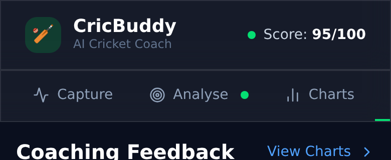

# 🏏 CricBuddy — AI Cricket Coaching App

> An AI-powered cricket coaching application that captures batsman footage, analyses technique using pose detection, and delivers professional graphical feedback.

---

## Table of Contents

- [Overview](#overview)
- [Features](#features)
- [Tech Stack](#tech-stack)
- [Getting Started](#getting-started)
- [Using the Application](#using-the-application)
  - [Step 1 — Capture Video](#step-1--capture-video)
  - [Step 2 — Analyse Shot](#step-2--analyse-shot)
  - [Step 3 — View Charts](#step-3--view-charts)
  - [Step 4 — Read Coaching Feedback](#step-4--read-coaching-feedback)
- [Application Snapshots](#application-snapshots)
- [Metrics Explained](#metrics-explained)
- [Project Structure](#project-structure)

---

## Overview

CricBuddy is built for cricket coaches and players who want data-driven insights into batting technique. Point a webcam at the batsman, record a shot, and in seconds the app:

1. Detects 17 body keypoints using **TensorFlow.js MoveNet**
2. Overlays a colour-coded skeleton on the video frame
3. Plots 6 interactive charts (radar, doughnut, time-series line/bar)
4. Generates detailed coaching feedback graded by severity

---

## Features

| Feature | Description |
|---|---|
| 📹 Live Recording | Record directly from webcam with pause/resume |
| 📂 Video Upload | Upload existing MP4 / WebM / MOV footage |
| 🦴 Skeleton Overlay | Real-time 17-point pose skeleton drawn on canvas |
| 📐 Biomechanical Metrics | Knee flexion, elbow angle, hip rotation, weight distribution, head position |
| 🎯 Shot Detection | Auto-detects drive, pull, cut, sweep or defence |
| 📊 6 Analytics Charts | Radar, doughnut and 4 time-series charts |
| 💬 Coaching Feedback | Severity-graded cards: Excellent / Good / Needs Work / Critical |
| 🏅 Score Ring | Animated overall technique score (0–100) |

---

## Tech Stack

| Layer | Technology |
|---|---|
| Framework | React 19 + TypeScript |
| Build Tool | Vite 8 |
| Styling | Tailwind CSS v4 |
| Pose Detection | TensorFlow.js MoveNet (CDN) |
| Charts | Chart.js + react-chartjs-2 |
| Icons | Lucide React |
| Video API | MediaRecorder + Canvas API |

---

## Getting Started

### Prerequisites

- Node.js 18+
- npm 9+
- A modern browser with WebGL support (Chrome / Edge recommended)

### Installation

```bash
# Clone the repository
git clone https://github.com/iamvikasknair/cricbuddy.git
cd cricbuddy

# Install dependencies
npm install

# Start the development server
npm run dev
```

Open `http://localhost:5173` in your browser.

### Production Build

```bash
npm run build
npm run preview
```

> **Note:** The app loads TensorFlow.js from CDN on first use. Ensure internet access is available when the app loads the MoveNet model (~3 MB).

---

## Using the Application

### Step 1 — Capture Video

Navigate to the **Capture** tab (active by default).

```
┌─────────────────────────────────────────────────────┐
│  🏏 CricBuddy          AI Cricket Coach             │
├──────────┬──────────┬──────────┬────────────────────┤
│ ● Capture│  Analyse │  Charts  │  Feedback          │
├─────────────────────────────────────────────────────┤
│                                                      │
│         Start Batting Analysis                       │
│    Record live or upload existing footage            │
│                                                      │
│  ┌─────────────────────┐  ┌────────────────────┐    │
│  │  📷  Live Camera    │  │  📂  Upload Video  │    │
│  │  Record from webcam │  │  MP4, WebM, MOV    │    │
│  └─────────────────────┘  └────────────────────┘    │
│                                                      │
└─────────────────────────────────────────────────────┘
```

**Option A — Live Camera:**
1. Click **Live Camera**
2. Allow browser camera permission when prompted
3. The webcam feed appears in the preview window
4. Click **Start Recording** (red button) to begin capturing
5. Use **Pause** to temporarily stop mid-shot if needed
6. Click **Stop & Analyse** when the shot is complete — the app automatically moves to the Analyse tab

**Option B — Upload Video:**
1. Click **Upload Video**
2. Select a `.mp4`, `.webm`, or `.mov` file from your device
3. The app loads the file and navigates to the Analyse tab automatically

---

### Step 2 — Analyse Shot

The **Analyse** tab shows the video with the AI skeleton overlay.

```
┌─────────────────────────────────────────────────────┐
│  🏏 CricBuddy                     Score: 78/100 ●   │
├──────────┬──────────┬──────────┬────────────────────┤
│  Capture │ ● Analyse│  Charts  │  Feedback          │
├─────────────────────────────────────────────────────┤
│  Video Analysis                   View Feedback  >  │
│ ┌───────────────────────────────────────────────┐   │
│ │                                  Knee  142°   │   │
│ │     [Video frame with skeleton overlay]       │   │
│ │                                  Elbow  95°   │   │
│ │  ●●●—●—●  (skeleton joints shown in colour)  │   │
│ │                                  Weight 58%fwd│   │
│ └───────────────────────────────────────────────┘   │
│  ▶ Play    ⏮ Restart                  🤖 Analyse    │
└─────────────────────────────────────────────────────┘
```

**Steps:**
1. The video loads automatically — click **Play** to preview it
2. Click **Analyse Shot** (green button, top-right of controls)
3. A progress bar shows the AI processing each frame (0–100%)
4. Once complete, the skeleton overlay appears on the video:
   - **Green lines** — body connections (bones)
   - **Gold dots** — head keypoints
   - **Orange dots** — wrist/hand keypoints
   - **Blue dots** — hip keypoints
5. A live HUD (top-right of video) shows real-time metrics as you scrub through
6. Click **View Feedback →** or switch to the **Charts** or **Feedback** tabs

**Skeleton key:**

| Colour | Body Part |
|--------|-----------|
| Gold `●` | Nose / Head |
| Green `●` | Shoulders |
| Light Green `●` | Elbows |
| Orange `●` | Wrists |
| Blue `●` | Hips |
| Cyan `●` | Knees |
| Purple `●` | Ankles |

---

### Step 3 — View Charts

The **Charts** tab displays 6 graphical analyses of the batting session.

```
┌─────────────────────────────────────────────────────┐
│  🏏 CricBuddy                     Score: 78/100 ●   │
├──────────┬──────────┬──────────┬────────────────────┤
│  Capture │  Analyse │ ● Charts │  Feedback          │
├─────────────────────────────────────────────────────┤
│  Performance Charts                                  │
│                                                      │
│  ┌──────────────────┐  ┌──────────────────┐         │
│  │  Technique Radar │  │  Head Position   │         │
│  │   ╱‾╲            │  │   ◕ Donut chart  │         │
│  │  /   \           │  │  Ideal / Hi / Lo │         │
│  └──────────────────┘  └──────────────────┘         │
│                                                      │
│  ┌──────────────────┐  ┌──────────────────┐         │
│  │  Knee Flexion °  │  │  Weight Dist. %  │         │
│  │  ~~~line chart~~ │  │  ~~~line chart~~ │         │
│  └──────────────────┘  └──────────────────┘         │
│                                                      │
│  ┌──────────────────┐  ┌──────────────────┐         │
│  │  Elbow Angle °   │  │  Hip Rotation °  │         │
│  │  ~~~line chart~~ │  │  ▐▌▌▐▌ bar chart │         │
│  └──────────────────┘  └──────────────────┘         │
└─────────────────────────────────────────────────────┘
```

| Chart | What it shows |
|---|---|
| **Technique Radar** | 7-axis spider chart scoring all technique dimensions vs ideal |
| **Head Position** | Doughnut showing % of frames where head was Ideal / Too High / Too Low |
| **Knee Flexion** | Line chart over time with ideal 130–155° band shaded |
| **Weight Distribution** | Front-foot weight % over time (50% = balanced) |
| **Elbow Angle** | Backlift height curve across the shot duration |
| **Hip Rotation** | Bar chart — green bars = good rotation (15–40°), gold = outside range |

Hover any data point for exact values in the tooltip.

---

### Step 4 — Read Coaching Feedback

The **Feedback** tab provides your overall score and actionable coaching notes.

```
┌─────────────────────────────────────────────────────┐
│  🏏 CricBuddy                     Score: 78/100 ●   │
├──────────┬──────────┬──────────┬────────────────────┤
│  Capture │  Analyse │  Charts  │ ● Feedback         │
├──────────────────────────────────────────────────────┤
│  Coaching Feedback              View Charts  >       │
│                                                      │
│  ┌─────────────────────────────────────────────┐    │
│  │   ╭────╮   Overall Technique Score          │    │
│  │   │ 78 │   78 / 100                         │    │
│  │   ╰────╯   Shot: Front Foot Drive           │    │
│  │            "Focus on leading with elbow…"   │    │
│  │   Duration: 2.4s   Frames: 24   Accuracy 92%│    │
│  └─────────────────────────────────────────────┘    │
│                                                      │
│  [ 2 Strengths ] [ 1 Good ] [ 1 Needs Work ] [ 0 ]  │
│                                                      │
│  ★ Excellent  Textbook Backlift                      │
│    Elbow angle of 95° indicates a high, correct…    │
│                                                      │
│  ✓ Good       Good Weight Balance                    │
│    Weight at 58% forward is well balanced…          │
│                                                      │
│  ⚠ Needs Work Limited Hip Rotation                   │
│    Your hips are not rotating enough through…       │
└─────────────────────────────────────────────────────┘
```

**Severity levels:**

| Badge | Meaning |
|---|---|
| ★ **Excellent** (green) | World-class technique in this area |
| ✓ **Good** (blue) | Solid, above-average execution |
| ⚠ **Needs Work** (yellow) | Correctable flaw that limits performance |
| ✗ **Critical** (red) | Fundamental error requiring immediate attention |

Feedback cards are sorted from most critical to most excellent so coaches can prioritise corrections.

---

## Application Snapshots

> All screenshots captured from a live build at 390×844 px (iPhone 14 Pro viewport, 2× retina) using demo session data.

### Capture Tab


The landing screen lets you choose between live webcam recording or uploading an existing video file.

### Capture Options


Both capture cards visible simultaneously — Live Camera (left) and Upload Video (right).

### Analyse Tab — Skeleton Overlay


The AI processes each frame and renders a colour-coded pose skeleton directly over the video. Live biomechanical metrics (knee angle, elbow angle, weight distribution) update as you scrub the timeline.

### Charts Tab — Technique Radar


A 7-axis radar chart compares all technique dimensions against ideal reference values. Green fill = strong, smaller area = needs attention.

### Charts Tab — Line Charts


Time-series line charts for Knee Flexion and Weight Distribution over the shot duration. Horizontal reference bands mark the ideal coaching zones.

### Charts Tab — Bar Chart


Hip Rotation bar chart (bottom of the Charts tab). Green bars indicate rotation within the ideal 15–40° coaching range.

### Feedback Tab — Score Ring


The animated score ring shows the overall technique score out of 100, shot type detection result, and session stats (duration, frames processed, pose accuracy).

### Feedback Tab — Coaching Cards


Severity-sorted coaching cards: ★ Excellent (green) → ✓ Good (blue) → ⚠ Needs Work (yellow) → ✗ Critical (red). Each card provides a specific, actionable coaching cue.

### App Header



The sticky header shows the app identity and a live score indicator dot (green ≥ 80, gold ≥ 60, red < 60) that updates after every analysis.

---

## Metrics Explained

| Metric | Ideal Range | How It's Measured |
|---|---|---|
| **Knee Flexion** | 130° – 155° | Angle at knee joint (hip → knee → ankle) |
| **Elbow Angle** | 80° – 130° | Dominant arm angle (shoulder → elbow → wrist) |
| **Hip Rotation** | 15° – 40° | Difference in shoulder/hip axis angles |
| **Weight Distribution** | 40% – 65% forward | Hip centre-of-mass relative to ankle span |
| **Head Position** | Ideal | Nose Y-position relative to hip height |
| **Overall Score** | 0 – 100 | Weighted average of all severity grades |

### Shot Auto-Detection Logic

| Shot | Primary Cues |
|---|---|
| **Front Foot Drive** | Deep knee bend (<130°), weight forward (>55%) |
| **Pull Shot** | High bat angle (>60°), weight on back foot (<45%) |
| **Cut Shot** | Moderate bat angle (>45°), back-foot weight |
| **Sweep** | Very deep knee bend (<120°) |
| **Defensive** | Straight knees (>155°), minimal movement |

---

## Project Structure

```
cricbuddy/
├── index.html                        # CDN TF.js script tags
├── vite.config.ts                    # Vite + Tailwind config
├── src/
│   ├── main.tsx                      # React entry point
│   ├── App.tsx                       # Root component
│   ├── index.css                     # Global styles + Tailwind
│   ├── types/
│   │   └── index.ts                  # Shared TypeScript types
│   ├── utils/
│   │   ├── poseUtils.ts              # Angle calc, frame analysis, feedback engine
│   │   └── simulation.ts             # Demo session generator (30-frame batting pose)
│   ├── hooks/
│   │   └── usePoseDetection.ts       # TF.js MoveNet hook + skeleton draw
│   └── components/
│       ├── VideoCapture/
│       │   └── VideoCapture.tsx      # Webcam recording + file upload
│       ├── PoseAnalysis/
│       │   └── VideoAnalyser.tsx     # Canvas overlay + frame-by-frame analysis
│       ├── Charts/
│       │   └── AnalyticsCharts.tsx   # All 6 Chart.js chart components
│       ├── Feedback/
│       │   └── FeedbackPanel.tsx     # Score ring + feedback cards
│       └── Dashboard/
│           └── Dashboard.tsx         # 4-tab app shell + routing
```

---

## Browser Requirements

| Browser | Support |
|---|---|
| Chrome 90+ | ✅ Full support |
| Edge 90+ | ✅ Full support |
| Firefox 88+ | ✅ Supported |
| Safari 15+ | ⚠ Camera access requires HTTPS |
| Mobile Chrome | ✅ Use rear camera for best results |

> For best pose detection accuracy, ensure the batsman is fully visible in frame, filmed from the side (leg-stump or off-stump camera angle), with good lighting.

---

## License

MIT © CricBuddy
