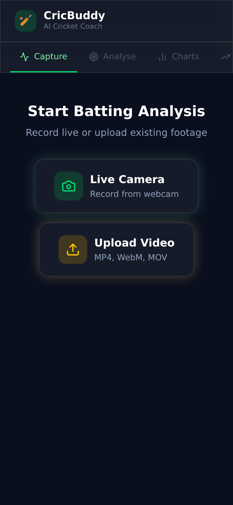
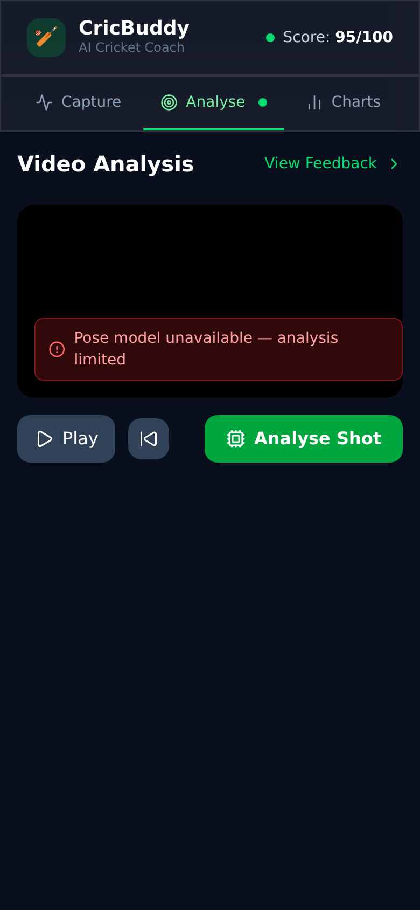
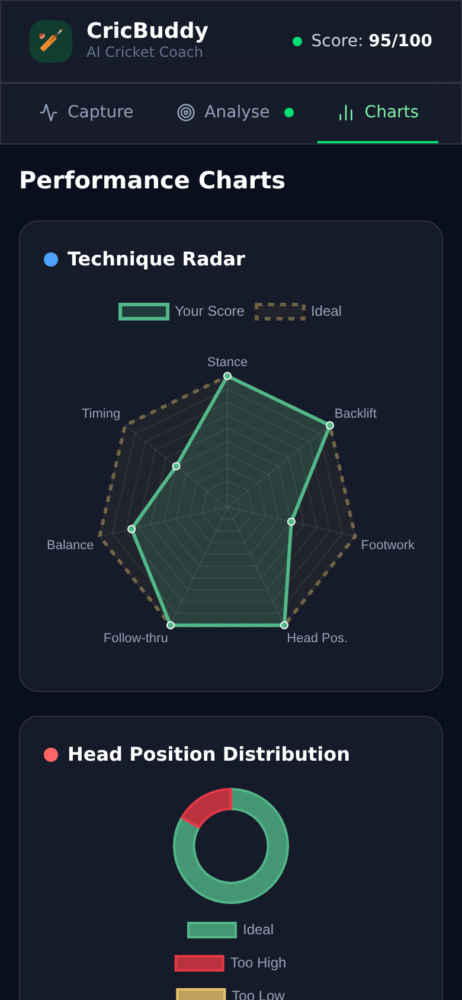
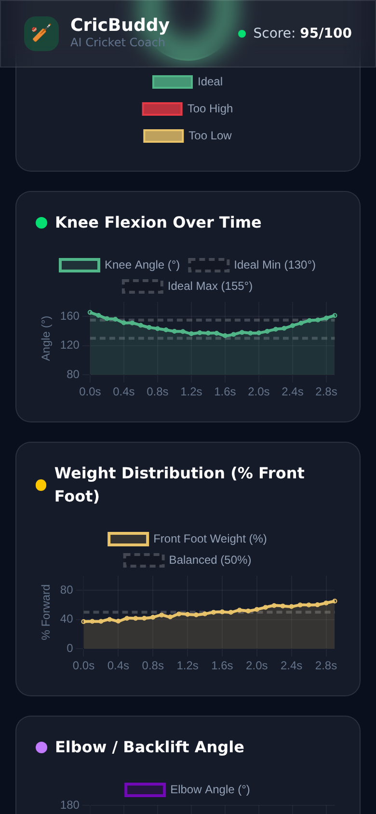
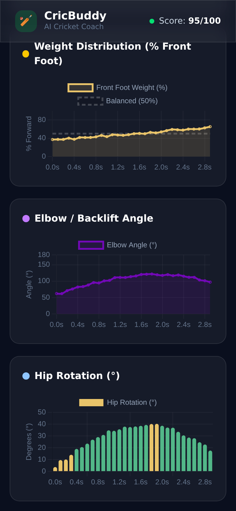
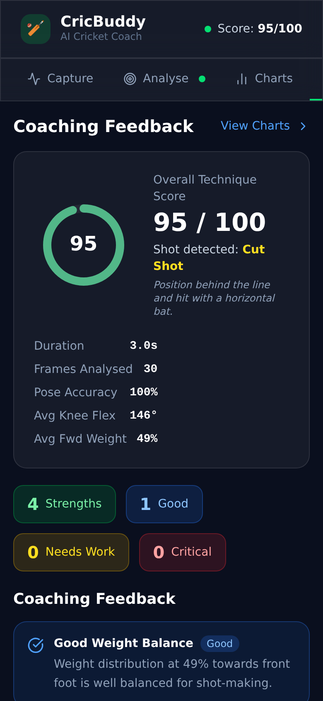
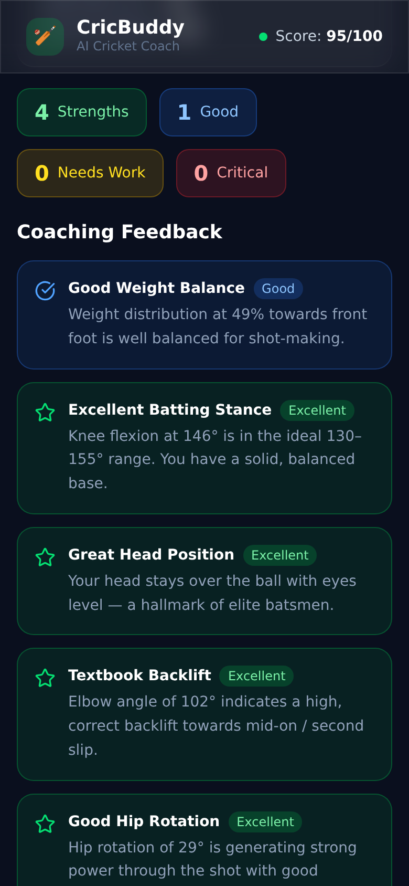
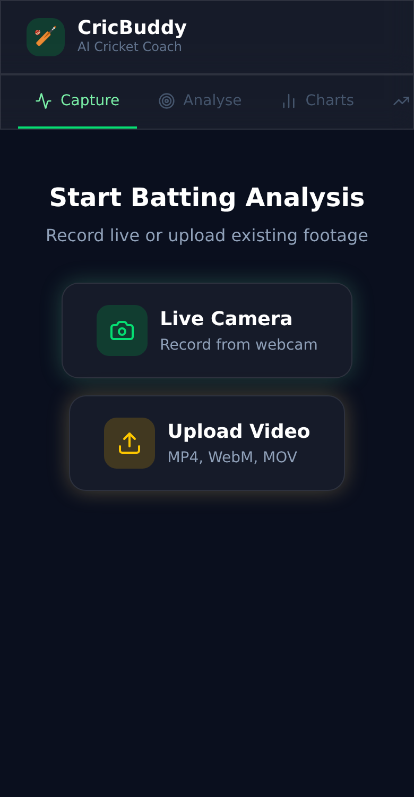

# 🏏 CricBuddy — AI Cricket Coaching App (Mobile)

> A React Native (Expo) cricket coaching application for iOS and Android. Records batting shots via the phone camera, analyses technique with AI pose detection, and delivers graphical feedback — all on-device.

---

## Table of Contents

- [Overview](#overview)
- [Features](#features)
- [Tech Stack](#tech-stack)
- [Getting Started](#getting-started)
  - [Prerequisites](#prerequisites)
  - [Installation](#installation)
  - [Running on Device](#running-on-device)
  - [Running on Simulator](#running-on-simulator)
- [Using the Application](#using-the-application)
  - [Step 1 — Capture Video](#step-1--capture-video)
  - [Step 2 — Analyse Shot](#step-2--analyse-shot)
  - [Step 3 — View Charts](#step-3--view-charts)
  - [Step 4 — Read Coaching Feedback](#step-4--read-coaching-feedback)
- [App Screens](#app-screens)
- [Metrics Explained](#metrics-explained)
- [Permissions](#permissions)
- [Project Structure](#project-structure)
- [Platform Compatibility](#platform-compatibility)

---

## Overview

CricBuddy Mobile brings AI cricket coaching to your pocket. A coach or player points their phone at the batsman from the side, records a shot, and the app:

1. Captures video using the device's native camera via **expo-camera**
2. Extracts frames and detects 17 body keypoints using **TensorFlow.js MoveNet**
3. Draws a colour-coded SVG skeleton overlay directly on the video
4. Renders 6 interactive charts: SVG radar, pie, line, and bar charts
5. Generates severity-graded coaching feedback with an overall technique score (0–100)

---

## Features

| Feature | Description |
|---|---|
| 📷 Live Camera Recording | Record batting shots using front or rear phone camera |
| 📂 Gallery Upload | Select existing batting videos from Photos / Gallery |
| 🦴 SVG Skeleton Overlay | 17-point pose skeleton rendered over video using react-native-svg |
| 📐 Biomechanical Metrics | Knee flexion, elbow angle, hip rotation, weight distribution, head position |
| 🎯 Auto Shot Detection | Identifies drive, pull, cut, sweep or defence automatically |
| 📊 6 Analytics Charts | Radar (SVG), Pie, 3× Line, Bar — all rendered natively |
| 💬 Coaching Feedback | Severity-graded cards: Excellent / Good / Needs Work / Critical |
| 🏅 SVG Score Ring | Animated circular score display (0–100) |
| 📱 Cross-Platform | Runs on both iOS (iPhone/iPad) and Android |

---

## Tech Stack

| Layer | Technology |
|---|---|
| Framework | React Native 0.74 + Expo ~51 |
| Language | TypeScript |
| Navigation | React Navigation v6 — Bottom Tabs |
| Camera | expo-camera |
| Video Playback | expo-av |
| Gallery Picker | expo-image-picker |
| Frame Extraction | expo-video-thumbnails |
| Pose Detection | TensorFlow.js MoveNet + @tensorflow/tfjs-react-native |
| Skeleton Overlay | react-native-svg (SVG `<Line>` + `<Circle>`) |
| Charts | react-native-chart-kit + custom SVG Radar |
| Score Ring | react-native-svg (custom circular progress) |
| Safe Area | react-native-safe-area-context |

---

## Getting Started

### Prerequisites

- **Node.js** 18 or higher
- **npm** 9 or higher
- **Expo CLI** — install globally: `npm install -g expo-cli`
- **Expo Go** app on your phone ([iOS App Store](https://apps.apple.com/app/expo-go/id982107779) / [Google Play](https://play.google.com/store/apps/details?id=host.exp.exponent))

For building native binaries (optional):
- **Xcode** 14+ (macOS only, for iOS simulator / App Store builds)
- **Android Studio** (for Android emulator / Play Store builds)

### Installation

```bash
# Clone the repository
git clone https://github.com/iamvikasknair/cricbuddy.git
cd cricbuddy

# Switch to the mobile branch
git checkout mobileApp

# Install dependencies
npm install --legacy-peer-deps
```

### Running on Device

The fastest way to run the app is on a real phone using **Expo Go**:

```bash
# Start the Expo development server
npx expo start
```

A QR code will appear in the terminal. Scan it with:
- **iPhone / iPad** — open the Camera app and scan, or use Expo Go
- **Android** — open Expo Go and tap "Scan QR code"

The app will bundle and launch on your device over your local Wi-Fi network.

### Running on Simulator

**iOS Simulator (macOS only):**

```bash
npx expo start --ios
```

**Android Emulator:**

```bash
npx expo start --android
```

### Production Builds (EAS)

To build a standalone `.ipa` or `.apk` for distribution:

```bash
# Install EAS CLI
npm install -g eas-cli

# Configure the project (first time only)
eas build:configure

# Build for iOS
eas build --platform ios

# Build for Android
eas build --platform android
```

---

## Using the Application

### Step 1 — Capture Video

Open the app. The **Capture** tab is active by default.



**Option A — Live Camera:**
1. Tap **Live Camera** — the app requests camera permission on first use
2. Point the phone at the batsman from the **side** (leg or off stump angle)
3. Ensure the **full body** is visible in the frame
4. Tap the large **red record button** (●) to start recording
5. Tap the **red square (■)** to stop — the app navigates to Analyse automatically

**Option B — Gallery Upload:**
1. Tap **Upload Video**
2. The Photos / Gallery picker opens — select a batting video
3. The app navigates to the Analyse tab automatically

> **Tip:** For best skeleton detection accuracy, film from 3–5 metres away with the batsman sideways to the camera.

---

### Step 2 — Analyse Shot

The **Analyse** tab shows the video player with the SVG skeleton overlay.



**Steps:**
1. The video loads automatically — use the native controls to preview it
2. Tap **Analyse Shot** (green button)
3. A progress bar (0–100%) shows frame extraction and pose analysis in progress
4. Once complete, the **SVG skeleton** appears over the video:

**Skeleton colour key:**

| Colour | Body Part |
|--------|-----------|
| Gold `●` | Nose / Head |
| Green `●` | Shoulders |
| Light Green `●` | Elbows |
| Orange `●` | Wrists |
| Blue `●` | Hips |
| Cyan `●` | Knees |
| Purple `●` | Ankles |
| Green lines | Bone connections |

5. A **live HUD** (top-right of video) shows Knee angle, Elbow angle, and Forward Weight %
6. Tap **View Coaching Feedback ›** or switch tabs

---

### Step 3 — View Charts

The **Charts** tab renders 6 native charts covering every dimension of technique.







Scroll down to see all 6 charts:

| Chart | Type | What it shows |
|---|---|---|
| **Technique Radar** | SVG polygon | 6-axis spider chart vs ideal profile |
| **Head Position** | Pie chart | % frames Ideal / Too High / Too Low |
| **Knee Flexion** | Line chart | Angle over shot duration (ideal 130–155°) |
| **Weight Distribution** | Line chart | Front-foot % over time (ideal 40–65%) |
| **Elbow / Backlift** | Line chart | Backlift height curve (ideal 80–130°) |
| **Hip Rotation** | Bar chart | Rotation per frame (ideal 15–40°) |

Tap any bar or line data point to see the exact value in a tooltip.

---

### Step 4 — Read Coaching Feedback

The **Feedback** tab gives the overall score and detailed coaching notes.





**Severity levels (sorted most critical first):**

| Badge | Colour | Meaning |
|---|---|---|
| ★ **Excellent** | Green | World-class technique in this area |
| ✓ **Good** | Blue | Solid, above-average execution |
| ⚠ **Needs Work** | Yellow | Correctable flaw that limits performance |
| ✗ **Critical** | Red | Fundamental error requiring immediate correction |

---

## App Screens

> Screenshots below are captured from the reference web build at 390×844 px (iPhone 14 Pro viewport). The React Native app renders the same data with native components.

### Capture Screen


Choose between live camera recording or importing from the device photo library.

### Capture Options



Both capture cards visible — Live Camera (left) and Upload Video (right).

### Analyse Screen — Skeleton Overlay


The AI processes each frame and renders a colour-coded SVG pose skeleton over the video. Live metrics (knee angle, elbow angle, weight distribution) appear in the HUD overlay.

### Charts Screen — Technique Radar


A 6-axis radar chart comparing all technique dimensions to ideal coaching values. Rendered natively with react-native-svg.

### Charts Screen — Line Charts


Time-series charts for Knee Flexion (top) and Weight Distribution (bottom) across the shot duration. Ideal coaching zones shown as shaded reference bands.

### Charts Screen — Hip Rotation Bar Chart


Per-frame Hip Rotation bar chart. Green bars = within ideal 15–40° range.

### Feedback Screen — Score Ring


The SVG score ring animates to the overall technique score (0–100). Shot type, session duration, frame count, and pose accuracy are displayed below.

### Feedback Screen — Coaching Cards


Severity-sorted coaching cards scroll below the score ring. Each card shows a badge (★ / ✓ / ⚠ / ✗), title, severity label, and a specific actionable coaching cue.

### Navigation

The app uses a **bottom tab navigator** with 4 tabs. Tabs are always visible. The Charts and Feedback tabs show an empty state until an analysis has been run.

---

## Metrics Explained

| Metric | Ideal Range | How It's Calculated |
|---|---|---|
| **Knee Flexion** | 130° – 155° | Angle at knee joint: hip → knee → ankle |
| **Elbow Angle** | 80° – 130° | Dominant arm: shoulder → elbow → wrist |
| **Hip Rotation** | 15° – 40° | Difference between shoulder and hip axis angles |
| **Weight Distribution** | 40% – 65% forward | Hip midpoint relative to ankle span |
| **Head Position** | Ideal | Nose Y-position relative to hip height |
| **Overall Score** | 0 – 100 | Weighted average across all severity grades |

### Shot Auto-Detection

| Shot Type | Primary Cues |
|---|---|
| **Front Foot Drive** | Knee <130°, weight forward >55% |
| **Pull Shot** | Bat angle >60°, weight back <45% |
| **Cut Shot** | Bat angle >45°, back-foot weight |
| **Sweep** | Knee <120° (very deep bend) |
| **Defensive** | Knees >155° (minimal flex) |

---

## Permissions

The app requests the following permissions at runtime:

| Permission | Platform | When Requested | Why |
|---|---|---|---|
| Camera | iOS + Android | Tapping "Live Camera" | To record batting video |
| Microphone | iOS + Android | Camera permission dialog | Required for video recording (audio track) |
| Photo Library Read | iOS | Tapping "Upload Video" | To select existing videos from gallery |
| External Storage Read | Android | Tapping "Upload Video" | To access video files on Android |

All permissions use the system dialog — the app never accesses the camera or gallery without the user explicitly initiating the action.

---

## Project Structure

```
cricbuddy/                          (mobileApp branch)
├── App.tsx                         # Root: GestureHandler + Navigation + SafeArea
├── app.json                        # Expo config (permissions, icons, bundle IDs)
├── babel.config.js                 # Expo + Reanimated Babel preset
├── tsconfig.json                   # TypeScript config for React Native
├── package.json                    # Expo + RN dependencies
│
└── src/
    ├── theme.ts                    # Colours, shared StyleSheet, chartConfig
    │
    ├── types/
    │   └── index.ts                # Shared TypeScript interfaces
    │
    ├── utils/
    │   ├── poseUtils.ts            # Angle calc, frame analysis, feedback engine, shot detection
    │   └── simulation.ts           # Realistic batting pose generator (demo / CI)
    │
    ├── hooks/
    │   └── usePoseDetection.ts     # TF.js MoveNet init + tensor analysis hook
    │
    ├── navigation/
    │   └── TabNavigator.tsx        # Bottom tab navigator (4 tabs)
    │
    ├── screens/
    │   ├── CaptureScreen.tsx       # Camera recording + gallery upload
    │   ├── AnalyseScreen.tsx       # Video player + SVG skeleton + frame analysis
    │   ├── ChartsScreen.tsx        # 6 charts (SVG radar, pie, line ×3, bar)
    │   └── FeedbackScreen.tsx      # Score ring + session stats + feedback cards
    │
    └── components/
        ├── SkeletonOverlay.tsx     # react-native-svg 17-keypoint skeleton
        ├── ScoreRing.tsx           # SVG circular progress score ring
        └── FeedbackCard.tsx        # Severity-badged coaching feedback card
```

---

## Platform Compatibility

| Platform | Version | Status |
|---|---|---|
| iOS (iPhone) | 13.0+ | ✅ Full support |
| iOS (iPad) | 13.0+ | ✅ Supported (portrait) |
| Android | API 21+ (5.0) | ✅ Full support |
| Expo Go | SDK 51 | ✅ Run instantly — no build needed |
| iOS Simulator | Xcode 14+ | ⚠ Camera unavailable in simulator |
| Android Emulator | API 26+ | ⚠ Camera limited in emulator |

> For the best experience with live camera recording and AI analysis, test on a **real physical device**.

---

## Branches

| Branch | Description |
|---|---|
| `claude/cricket-video-analysis-MF7fZ` | Web app (Vite + React + Tailwind CSS) |
| `mobileApp` | This branch — React Native (Expo) for iOS + Android |

---

## License

MIT © CricBuddy
